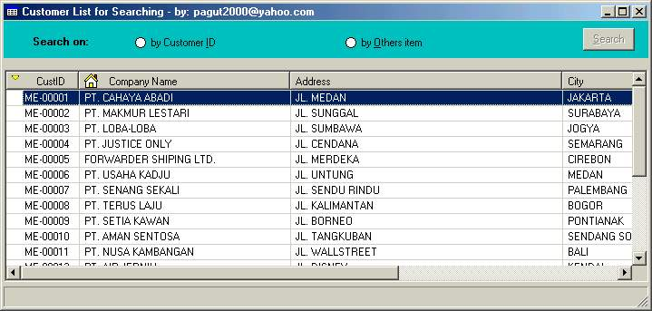



## Search Item Data in ListView Control

### Description

Demonstrates how to search/ find data item in ListView Control (ADO). Facilities:

1. Search by index

2. Search by others criteria

3. Sort data in the listview control by HeadColumn

4. Automatic resize control
 
### More Info
 

             |
---                |---
**Submitted On**   |2004-07-10 23:57:48
**By**             |[Paul PS](https://github.com/Planet-Source-Code/PSCIndex/blob/master/ByAuthor/paul-ps.md)
**Level**          |Intermediate
**User Rating**    |4.0 (8 globes from 2 users)
**Compatibility**  |VB 6\.0
**Category**       |[Databases/ Data Access/ DAO/ ADO](https://github.com/Planet-Source-Code/PSCIndex/blob/master/ByCategory/databases-data-access-dao-ado__1-6.md)
**World**          |[Visual Basic](https://github.com/Planet-Source-Code/PSCIndex/blob/master/ByWorld/visual-basic.md)
**Archive File**   |[Search\_Ite1768847122004\.zip](https://github.com/Planet-Source-Code/paul-ps-search-item-data-in-listview-control__1-54896/archive/master.zip)

